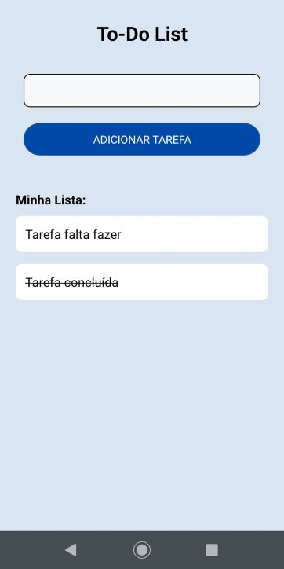

# To-Do List

<p align="left">
    
    
</p>

App de lista desenvolvido com React Native para fins de estudo.

## :hammer: Funcionalidades do projeto
- `Cadastro de tarefa:` cadastro de tarefas a serem feitas.
- `Marcar tarefa como concluída:` possibilidade de marcar tarefas como concluídas.

<br>
<div display: inline_block align="center">
   
</div>

## :file_folder: Acesso ao projeto
Você pode [acessar o código-fonte do projeto](https://github.com/GabrielSchiavo/to-do-list) ou [baixá-lo](https://github.com/GabrielSchiavo/to-do-list/archive/refs/heads/main.zip).

## 	:hammer_and_wrench: Abrir e rodar o projeto
Após baixar o projeto, você pode abrir com o Visual Studio Code. Para o projeto funcionar você deve ter configurado no seu PC:

* Node.js - Versão >=16.14.2

Agora, você deve executar em um terminal o seguinte comando para instalar o Expo:
```bash
npm install --global expo-cli
```

Após executar esse comando abra outro terminal na pasta do projeto e execute este comando para instalar as dependências do projeto:
```bash
npm install
```

Agora basta iniciar o projeto com o seguinte comando:
```bash
npx expo start
```

## :white_check_mark: Tecnologias utilizadas
* `Expo - 48.0.0`
* `JavaScript`
* `Node.js - 18.15.0`
* `React - 18.2.0`
* `React Native - 0.71.4`
